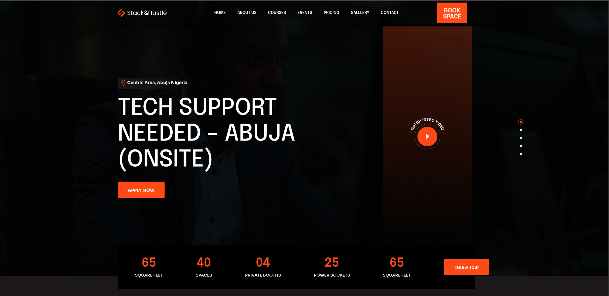
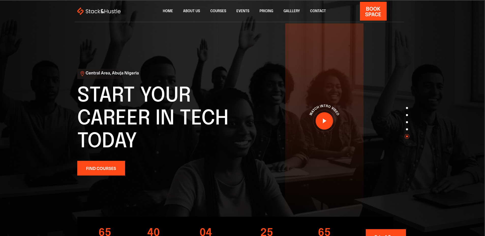
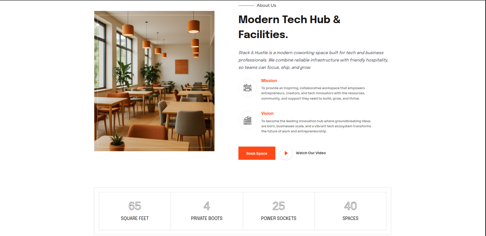
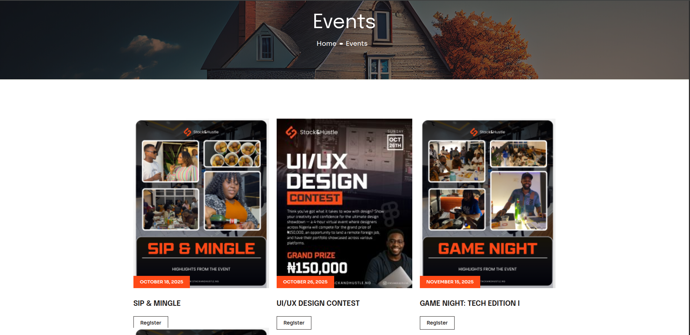
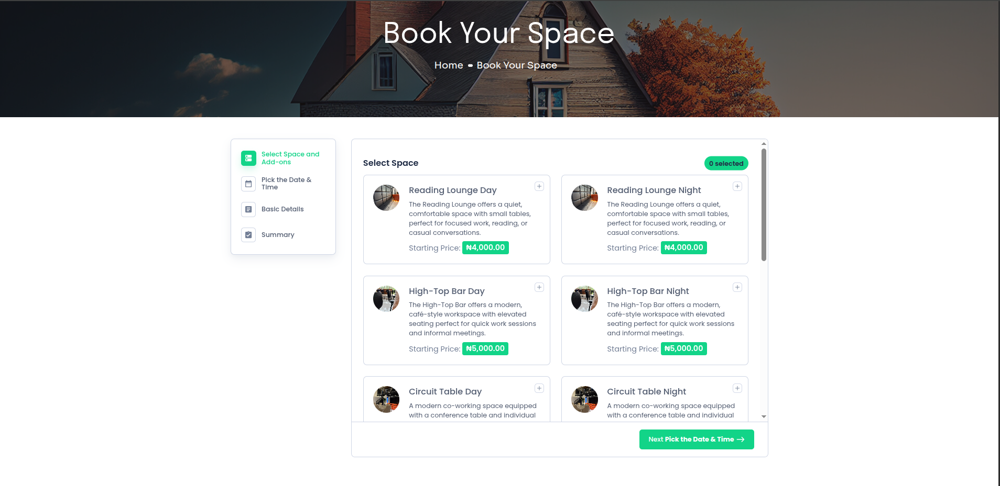

# Stack & Hustle WordPress Theme



A custom WordPress website developed for **Stack & Hustle**, a coworking, technology, and innovation hub located in Abuja, Nigeria. The platform serves as a central destination for workspace bookings, events, training programs, community engagement, and opportunities within the tech ecosystem.

## 🌐 Live Website

https://stackandhustle.com

---

## 📖 Project Overview

Stack & Hustle is a modern coworking and technology hub designed to support entrepreneurs, startups, creatives, remote workers, and aspiring tech professionals.

The website was built to provide:

- Workspace booking and reservations
- Course and training program listings
- Event promotion and registration
- Community engagement
- Team and mentor showcases
- Business information and contact channels
- Responsive user experience across desktop and mobile devices

---

## 🚀 My Contributions

As the developer, my responsibilities included:

- Customizing and maintaining WordPress theme templates
- Developing custom page layouts and content structures
- Creating and modifying PHP template files
- Implementing responsive UI/UX improvements
- Integrating booking functionality using BookingPress
- Managing custom post types and dynamic content
- Styling pages with custom CSS
- Configuring plugins and WordPress settings
- Optimizing navigation and user experience
- Supporting ongoing website updates and content management

---

## 🛠 Technologies Used

- WordPress
- PHP
- HTML5
- CSS3
- JavaScript
- BookingPress
- Custom WordPress Templates
- Responsive Design

---

## 📸 Screenshots

### Homepage



### About Page




### Events Page



### Booking Page




---

## 📂 Project Structure

```text
stackandhustle-wordpress-theme/
├── assets/
├── screenshots/
│   ├── cover.png
│   ├── homepage.png
│   ├── about-page.png
│   ├── courses-page.png
│   ├── events-page.png
│   ├── booking-page.png
│   └── gallery-page.png
│
├── functions.php
├── header.php
├── footer.php
├── home.php
├── style.css
├── index.php
├── page.php
├── single.php
└── README.md
```

---

## ✨ Key Features

- Modern coworking space website
- Workspace reservation system
- Course and training program management
- Event management and promotion
- Team member profiles
- Responsive mobile-friendly design
- Gallery and media showcases
- Contact and inquiry functionality
- Custom WordPress templates

---

## 🎯 Business Goals Supported

The website was built to help Stack & Hustle:

- Promote technology education
- Connect local talent with opportunities
- Showcase events and community activities
- Increase workspace bookings
- Support startup and entrepreneur growth
- Strengthen the Abuja tech ecosystem

---

## 🔗 Repository Purpose

This repository serves as a portfolio showcase of the WordPress theme and development work completed for the Stack & Hustle website.

---

## ⚠️ Disclaimer

This repository contains the custom WordPress theme source code used for the Stack & Hustle website.

Certain media assets, business content, images, and proprietary information belong to Stack & Hustle and may not be included in this repository.

---

## 👨‍💻 Developer

**Iyobosa Amaddin (codeandbe)**

- GitHub: https://github.com/codeandbe
- LinkedIn: https://linkedin.com/in/codeandbe

---

## 🌍 Live Demo

https://stackandhustle.com